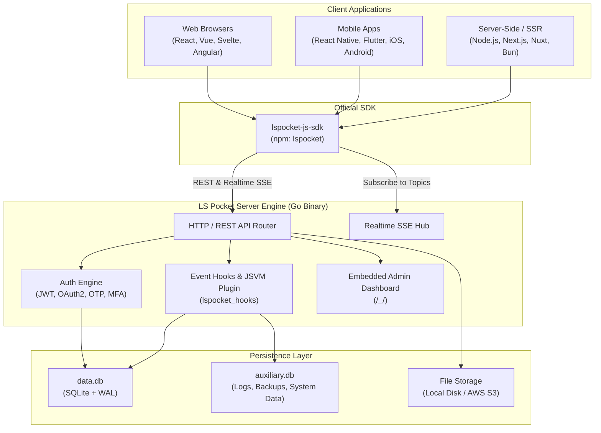

# LS Pocket

<p align="center">
  
</p>

<p align="center">
  <strong>An open-source, lightweight, high-performance real-time backend in 1 file.</strong><br>
  Embedded SQLite with WAL mode, real-time subscriptions, built-in Superuser dashboard, and extensible Go/JS APIs.
</p>

<p align="center">
  <a href="https://github.com/girishlade111/LS-Pocket/releases"></a>
  <a href="https://github.com/girishlade111/lspocket-js-sdk"></a>
  <a href="LICENSE.md"></a>
  <a href="https://github.com/girishlade111/LS-Pocket/stargazers"></a>
</p>

---

> 🔗 **Companion Repositories:**
> - **Backend Server (This Repo):** [github.com/girishlade111/LS-Pocket](https://github.com/girishlade111/LS-Pocket)
> - **JavaScript / TypeScript SDK:** [github.com/girishlade111/lspocket-js-sdk](https://github.com/girishlade111/lspocket-js-sdk) *(also available in this repository under [`lspocket-js-sdk/`](./lspocket-js-sdk))*

---

## Table of Contents

- [Overview](#overview)
- [Key Features](#key-features)
- [Architecture](#architecture)
- [Repository Structure](#repository-structure)
- [Getting Started](#getting-started)
  - [Prerequisites](#prerequisites)
  - [Running from Source](#running-from-source)
  - [Building the Executable](#building-the-executable)
- [Command Line Interface (CLI)](#command-line-interface-cli)
- [Superuser Admin Dashboard](#superuser-admin-dashboard)
- [Companion Client SDK (`lspocket-js-sdk`)](#companion-client-sdk-lspocket-js-sdk)
  - [Installation](#installation)
  - [Quick Example](#quick-example)
  - [Submodule Synchronization](#submodule-synchronization)
- [Extending LS Pocket](#extending-ls-pocket)
  - [Go Embedding](#go-embedding)
  - [JavaScript Hooks (JSVM)](#javascript-hooks-jsvm)
- [Database & Storage](#database--storage)
- [Security & Authentication](#security--authentication)
- [Deployment](#deployment)
  - [Systemd Service](#systemd-service)
  - [Docker](#docker)
- [Contributing](#contributing)
- [Attribution & License](#attribution--license)

---

## Overview

**LS Pocket** is a comprehensive, standalone backend solution written in Go that packages database persistence, file storage, authentication, real-time events, and an administrative user interface into a single deployable binary.

Designed for developers who want the speed of Firebase/Supabase without cloud lock-in or complex microservice infrastructure, LS Pocket stores data locally using SQLite with Write-Ahead Logging (WAL) and serves REST APIs along with Server-Sent Events (SSE) out of the box.

---

## Key Features

- ⚡ **Single File Distribution**: Zero external database servers required. Run everything from a single binary.
- 🗄️ **Embedded SQLite + WAL**: High read/write throughput with concurrency-safe database pooling (`data.db` and `auxiliary.db`).
- 🔄 **Realtime Subscriptions**: Built-in Server-Sent Events (SSE) support for live data synchronization without WebSockets overhead.
- 🔐 **Authentication & Authorization**:
  - Email & Password with automatic verification and password resets.
  - OAuth2 providers (Google, GitHub, Apple, Discord, Microsoft, Facebook, and more).
  - One-Time Passwords (OTP) and Multi-Factor Authentication (MFA).
- 📁 **File Storage**: Local file uploads with automatic thumbnail generation or transparent routing to S3-compatible object storage.
- 🖥️ **Integrated Superuser UI**: Modern, responsive administrative dashboard embedded directly into the Go executable.
- 🧩 **Extensible**:
  - Extend via Go by importing `github.com/pocketbase/pocketbase`.
  - Extend via JavaScript/TypeScript using the embedded `jsvm` engine (`lspocket_hooks/`).
- ⏰ **Automated Backups & Cron**: Schedule recurring tasks and create full database zip backups on-the-fly.
- 📦 **Official Client SDK**: Full-featured [LS Pocket JavaScript/TypeScript SDK](https://github.com/girishlade111/lspocket-js-sdk) with typed models and auto-cancellation.

---

## Architecture



---

## Repository Structure

```text
LS-Pocket/
├── apis/                   # HTTP request handlers, middlewares, and API route definitions
├── cmd/                    # CLI commands implementation (serve, superuser)
├── core/                   # Core application runtime, models, database abstraction, and event hooks
├── examples/
│   └── base/
│       └── main.go         # Default entry point for standalone LS Pocket executable
├── forms/                  # Form validation and request binding handlers
├── lspocket-js-sdk/        # Submodule: Official JavaScript/TypeScript SDK (see companion repo)
├── mails/                  # Email templates for verification, reset, and authentication
├── migrations/             # Built-in system database migrations
├── pb_data/                # Default local data directory (data.db, auxiliary.db, storage)
├── plugins/
│   ├── jsvm/               # JavaScript engine (Goja) for running custom hooks & migrations
│   └── migratecmd/         # Migration command utilities
├── tests/                  # Integration tests and automated test suites
├── tools/                  # Utility helpers (security, filesystem, subscriptions, cron)
├── ui/                     # Superuser Admin UI source code (Vite + Modern Web Frontend)
├── go.mod                  # Go module definition (Go 1.27+)
├── Makefile                # Build automation targets
└── README.md               # Repository documentation
```

---

## Getting Started

### Prerequisites

- **Go**: Version `1.27` or later installed ([golang.org](https://golang.org)).
- **C Compiler / GCC**: Optional, modernc SQLite pure-Go driver is used by default.
- **Node.js**: Version `18+` (only required if building the Superuser UI or JS SDK).

### Running from Source

You can immediately boot the backend server from the root directory:

```bash
# Run the standalone server
go run ./examples/base/main.go serve

# Or with custom flags
go run ./examples/base/main.go serve --http="0.0.0.0:8090" --dir="./lspocket_data"
```

Once started:
- **REST API Endpoint**: `http://127.0.0.1:8090/api/`
- **Superuser Dashboard**: `http://127.0.0.1:8090/_/`

### Building the Executable

To produce a single, production-ready binary:

```bash
# Windows
go build -o lspocket.exe ./examples/base/main.go

# Linux / macOS
go build -o lspocket ./examples/base/main.go
```

---

## Command Line Interface (CLI)

LS Pocket includes a rich command-line interface:

### 1. `serve`
Starts the HTTP web server and realtime engine.

```bash
./lspocket.exe serve [flags]
```

**Common Flags:**
| Flag | Description | Default |
|---|---|---|
| `--http` | TCP address to listen on for HTTP | `127.0.0.1:8090` |
| `--https` | TCP address to listen on for HTTPS (enables Auto-TLS via Let's Encrypt) | `""` |
| `--dir` | Directory where SQLite databases and files are stored | `./lspocket_data` |
| `--publicDir` | Directory for serving static website assets | `./lspocket_public` |
| `--hooksDir` | Directory containing JavaScript app hooks | `./lspocket_hooks` |
| `--hooksWatch` | Watch hooks directory and reload automatically | `true` |
| `--dev` | Enables development mode with debug logs | `false` |
| `--encryptionEnv` | Environment variable containing the secret database encryption key | `""` |

### 2. `superuser`
Manage superuser administrative accounts without opening a browser:

```bash
# Create a new superuser
./lspocket.exe superuser create admin@example.com "YourPassword123!"

# Update an existing superuser password
./lspocket.exe superuser update admin@example.com "NewPassword123!"

# Delete a superuser
./lspocket.exe superuser delete admin@example.com
```

### 3. `migrate`
Inspect and apply schema migrations:

```bash
# Apply pending migrations
./lspocket.exe migrate up

# Revert previous migration
./lspocket.exe migrate down

# Create a new JS migration template
./lspocket.exe migrate create "add_posts_table"
```

---

## Superuser Admin Dashboard

The Admin Dashboard provides a visual management interface for your entire application:

- **Collections Manager**: Create and modify Base, Auth, and View collections. Configure field validation rules and indexes.
- **Data Browser**: Search, filter, edit, sort, and batch delete records.
- **API Rules & Access Control**: Configure granular permissions (`listRule`, `viewRule`, `createRule`, `updateRule`, `deleteRule`) using dynamic filter expressions.
- **Authentication Settings**: Enable/disable OAuth2 providers, customize email verification/password reset templates, and set token lifetimes.
- **Logs & Analytics**: Live request viewer with status codes, latency, client IP, and query execution times.
- **Backups**: Download instantaneous zip snapshots of your database or schedule automated daily/weekly backups.

To modify or build the UI from source:

```bash
cd ui
npm install
npm run dev     # Starts local Vite development server
npm run build   # Formats and builds production assets into ui/dist
```

---

## Companion Client SDK (`lspocket-js-sdk`)

The official client library for interacting with LS Pocket is [`lspocket-js-sdk`](https://github.com/girishlade111/lspocket-js-sdk). It supports Browser, Node.js, Bun, Deno, and React Native.

### Installation

```bash
npm install lspocket --save
# or
pnpm add lspocket
# or
yarn add lspocket
```

### Quick Example

```javascript
import LSPocket from 'lspocket';

// 1. Initialize client pointing to your LS Pocket server
const pb = new LSPocket('http://127.0.0.1:8090');

// 2. Authenticate as a user
const authData = await pb.collection('users').authWithPassword('user@example.com', 'secure_password');
console.log('Logged in as:', pb.authStore.model.email);

// 3. Query records with safe filter binding
const records = await pb.collection('posts').getList(1, 20, {
    filter: pb.filter('status = {:status} && created >= {:startDate}', {
        status: 'published',
        startDate: new Date('2026-01-01')
    }),
    sort: '-created',
    expand: 'author',
});

// 4. Realtime Subscription (SSE)
await pb.collection('posts').subscribe('*', (e) => {
    console.log('Action:', e.action); // 'create', 'update', or 'delete'
    console.log('Record:', e.record);
});
```

### Submodule Synchronization

The SDK is included in this repository as a Git submodule under `lspocket-js-sdk/`. To initialize or update it:

```bash
# Clone with submodule
git clone --recurse-submodules git@github.com:girishlade111/LS-Pocket.git

# Or initialize if already cloned
git submodule update --init --recursive

# Pull latest commits from the SDK repository
git submodule update --remote lspocket-js-sdk
```

For full client SDK documentation, visit the [lspocket-js-sdk repository](https://github.com/girishlade111/lspocket-js-sdk).

---

## Extending LS Pocket

### Go Embedding

You can use LS Pocket as a Go library to write custom business logic:

```go
package main

import (
    "log"
    "net/http"

    "github.com/pocketbase/pocketbase"
    "github.com/pocketbase/pocketbase/core"
)

func main() {
    app := pocketbase.New()

    // Add custom HTTP endpoint
    app.OnServe().BindFunc(func(e *core.ServeEvent) error {
        e.Router.GET("/api/hello", func(e *core.RequestEvent) error {
            return e.JSON(http.StatusOK, map[string]string{
                "message": "Hello from LS Pocket!",
            })
        })
        return e.Next()
    })

    // Hook into record creation event
    app.OnRecordCreate("orders").BindFunc(func(e *core.RecordEvent) error {
        log.Printf("New order received: %s", e.Record.Id)
        return e.Next()
    })

    if err := app.Start(); err != nil {
        log.Fatal(err)
    }
}
```

### JavaScript Hooks (JSVM)

If you prefer JavaScript/TypeScript, place your `.js` or `.pb.js` scripts inside the `lspocket_hooks/` folder:

```javascript
// lspocket_hooks/orders.pb.js
onRecordCreate((e) => {
    console.log("New order created with ID: " + e.record.id);

    // Modify or validate record before saving
    e.record.set("status", "pending_review");
    e.next();
}, "orders");

routerAdd("GET", "/api/custom-metrics", (c) => {
    return c.json(200, { uptime: "running", activeUsers: 42 });
});
```

---

## Database & Storage

LS Pocket maintains two primary SQLite database files inside your data directory (`./lspocket_data`):

1. **`data.db`**: Stores all collections, records, schema definitions, and application configuration.
2. **`auxiliary.db`**: Stores request audit logs, hourly/daily request statistics, and backup archives metadata.

### Concurrency & Write-Ahead Logging
- SQLite is configured in **WAL mode (`PRAGMA journal_mode=WAL`)** by default.
- Reads do not block writes, and writes do not block reads.
- Connection pooling handles concurrent traffic smoothly with configurable open and idle connection thresholds.

---

## Security & Authentication

- **Argon2 / Bcrypt Password Hashing**: Passwords are cryptographically salted and hashed.
- **Encrypted Database Fields**: Sensitive settings (OAuth2 secrets, SMTP passwords) can be encrypted at rest using the `--encryptionEnv` flag.
- **Granular API Rules**: Access rules are evaluated server-side against the JWT authentication context (`@request.auth.id != ""`, `@request.auth.role = 'admin'`).
- **Rate Limiting**: Built-in request rate limiting protects against brute force attacks.
- **CSRF & CORS**: Configurable CORS origins and secure token transmission.

---

## Deployment

### Systemd Service (Linux)

Create `/etc/systemd/system/lspocket.service`:

```ini
[Unit]
Description=LS Pocket Server
After=network.target

[Service]
Type=simple
User=www-data
Group=www-data
LimitNOFILE=65536
WorkingDirectory=/var/www/lspocket
ExecStart=/var/www/lspocket/lspocket serve --http="127.0.0.1:8090" --dir="/var/www/lspocket/lspocket_data"
Restart=always
RestartSec=5s

[Install]
WantedBy=multi-user.target
```

Enable and start:
```bash
sudo systemctl daemon-reload
sudo systemctl enable --now lspocket
```

### Docker

Example `Dockerfile`:

```dockerfile
FROM golang:1.27-alpine AS builder
WORKDIR /app
COPY go.mod go.sum ./
RUN go mod download
COPY . .
RUN CGO_ENABLED=0 GOOS=linux go build -o /app/lspocket ./examples/base/main.go

FROM alpine:latest
RUN apk add --no-cache ca-certificates
WORKDIR /pb
COPY --from=builder /app/lspocket /pb/lspocket
EXPOSE 8090
VOLUME /pb/lspocket_data
CMD ["/pb/lspocket", "serve", "--http=0.0.0.0:8090", "--dir=/pb/lspocket_data"]
```

---

## Contributing

Contributions, bug reports, and suggestions are welcome!

1. Fork the repository: [`github.com/girishlade111/LS-Pocket`](https://github.com/girishlade111/LS-Pocket)
2. Create a feature branch: `git checkout -b feat/amazing-feature`
3. Commit your changes: `git commit -m 'feat: add amazing feature'`
4. Push to branch: `git push origin feat/amazing-feature`
5. Open a Pull Request.

---

## Attribution & License

- **Attribution**: This project is forked and customized from [PocketBase](https://github.com/pocketbase/pocketbase) created by Gani Georgiev. We gratefully acknowledge the creators and contributors of the upstream project.
- **License**: LS Pocket is open-source software licensed under the [MIT License](LICENSE.md).
